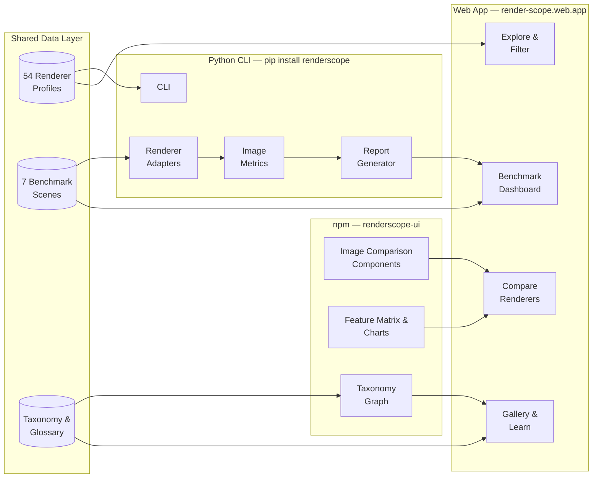
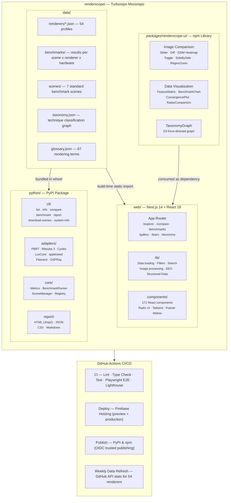
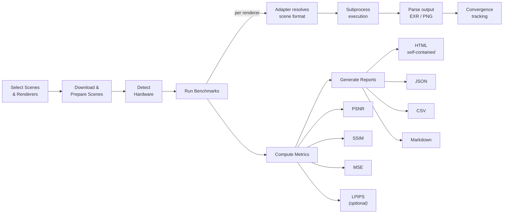
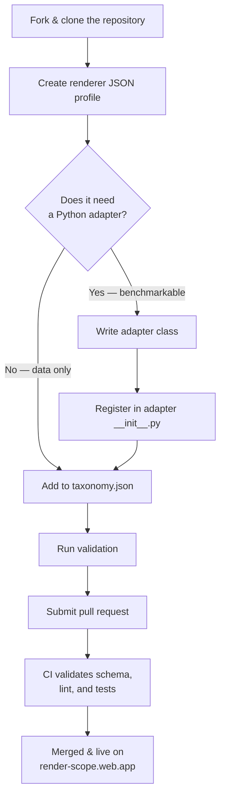
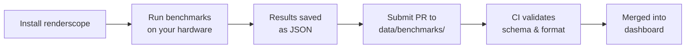

<p align="center">
  <h1 align="center">RenderScope</h1>
  <p align="center">
    <strong>The open-source platform for cataloging, comparing, and benchmarking rendering engines.</strong>
  </p>
  <p align="center">
    <a href="https://render-scope.web.app">Website</a> &middot;
    <a href="https://render-scope.web.app/docs">Documentation</a> &middot;
    <a href="https://pypi.org/project/renderscope/">PyPI</a> &middot;
    <a href="https://www.npmjs.com/package/renderscope-ui">npm</a>
  </p>
  <p align="center">
    <a href="https://github.com/renderscope-dev/renderscope/actions/workflows/ci.yml"></a>
    <a href="https://github.com/renderscope-dev/renderscope/actions/workflows/deploy.yml"></a>
    <a href="https://pypi.org/project/renderscope/"></a>
    <a href="https://www.npmjs.com/package/renderscope-ui"></a>
    <a href="https://opensource.org/licenses/Apache-2.0"></a>
    <a href="https://pypi.org/project/renderscope/"></a>
  </p>
</p>

---

RenderScope is a unified ecosystem for exploring, comparing, and benchmarking open-source rendering engines. It catalogs **54 renderers** across **8 rendering techniques** — from classical path tracers and rasterizers to neural radiance fields, 3D Gaussian Splatting, differentiable renderers, and volume renderers — with standardized metadata, reproducible benchmarks, and interactive visual comparison tools.

<br>

## Why RenderScope

The rendering landscape is vast and fragmented. Choosing the right engine for a research paper, a production pipeline, or a personal project means navigating dozens of repositories with incompatible data formats, undocumented feature sets, and no standardized way to compare quality or performance.

RenderScope solves this by providing:

- **A structured catalog** of 54 rendering engines with normalized metadata — techniques, features, platforms, GPU APIs, file format support, license, and community health
- **Visual comparison tools** to see the actual difference between renderers on the same scene, pixel by pixel
- **Reproducible benchmarks** with standardized scenes, consistent settings, and hardware-aware profiling
- **Educational resources** explaining the techniques behind each renderer, with an interactive glossary of 67 terms

<br>

## The Ecosystem

RenderScope is three tools that work together:

### Web Application &nbsp; `render-scope.web.app`

An interactive Next.js application for browsing, comparing, and learning about rendering engines.

- **Explore** — Filter and search 54 renderers by technique, language, GPU support, license, and status
- **Compare** — Side-by-side feature matrices, six image comparison modes (slider, toggle, diff, SSIM heatmap, side-by-side, region zoom), and performance charts
- **Benchmarks** — Dashboard with per-scene breakdowns, convergence plots, hardware profiles, and exportable data
- **Gallery** — Curated renders from 7 standard benchmark scenes across multiple renderers
- **Taxonomy** — Interactive D3 force-directed graph visualizing renderer relationships by technique
- **Learn** — Technique deep-dives, a searchable glossary, and a historical timeline of renderer releases

### Python Package &nbsp; `pip install renderscope`

A CLI tool and library for benchmarking, image quality analysis, and report generation.

```bash
renderscope list                          # Browse the renderer catalog
renderscope list --technique neural       # Filter by technique
renderscope compare ref.exr test.exr      # PSNR, SSIM, MSE, LPIPS
renderscope benchmark --scene sponza      # Run standardized benchmarks
renderscope report results.json -f html   # Generate self-contained HTML reports
renderscope system-info                   # Detect CPU, GPU, RAM
```

- **7 renderer adapters** — PBRT, Mitsuba 3, Blender Cycles, LuxCoreRender, appleseed, Filament, OSPRay
- **Image quality metrics** — PSNR, SSIM, MSE, false-color diff maps, and optional LPIPS (via PyTorch)
- **Report generation** — Self-contained HTML with embedded images, plus JSON, CSV, and Markdown
- **Scene management** — Download, convert, and manage standard benchmark scenes

### npm Package &nbsp; `npm install renderscope-ui`

Reusable React components for embedding renderer comparisons in any application.

```tsx
import { ImageCompareSlider, FeatureMatrix, TaxonomyGraph } from 'renderscope-ui';
import 'renderscope-ui/styles';
```

- **Image comparison** — `ImageCompareSlider`, `ImageDiff`, `ImageSSIMHeatmap`, `ImageToggle`, `ImageSideBySide`, `RegionZoom`
- **Data visualization** — `FeatureMatrix`, `BenchmarkChart`, `ConvergencePlot`, `RadarComparison`
- **Taxonomy** — Interactive `TaxonomyGraph` with D3 force simulation
- **Tree-shakeable** — Import only what you use; core bundle under 50KB gzipped

<br>

## Rendering Techniques Covered

| Technique | Description | Example Renderers |
|-----------|-------------|-------------------|
| **Path Tracing** | Unbiased global illumination via stochastic light-path sampling | PBRT, Mitsuba 3, LuxCore, Cycles |
| **Ray Tracing** | Image synthesis by tracing rays from camera into the scene | Embree, OSPRay, Filament |
| **Rasterization** | Real-time rendering by projecting primitives onto a 2D pixel grid | Eevee, Three.js, Babylon.js, Godot |
| **Neural Rendering** | Learned representations for novel view synthesis | Instant-NGP, Nerfstudio, NeRF |
| **Gaussian Splatting** | Projecting and compositing 3D Gaussian primitives | 3D Gaussian Splatting, gsplat |
| **Differentiable Rendering** | Renderers differentiable w.r.t. scene parameters for inverse problems | Mitsuba 3, Redner, nvdiffrast |
| **Volume Rendering** | Direct visualization of 3D scalar or vector fields | OSPRay, VTK, ParaView |
| **Educational** | Minimal or tutorial-oriented renderers for learning | Ray Tracing in One Weekend, smallpt |

<br>

## Quick Start

### Web Application

```bash
git clone https://github.com/renderscope-dev/renderscope.git
cd renderscope
npm install
npm run dev --workspace=web
```

Open [http://localhost:3000](http://localhost:3000).

### Python Package

```bash
pip install renderscope

# Optional extras
pip install renderscope[ml]      # LPIPS metric (PyTorch)
pip install renderscope[plots]   # Chart generation (Matplotlib)
pip install renderscope[all]     # Everything
```

### npm Package

```bash
npm install renderscope-ui react react-dom
```

<br>

## Project Structure

```text
renderscope/
├── web/                        Next.js 14 web application (171 React components)
├── packages/
│   └── renderscope-ui/         Reusable React component library (ESM + CJS)
├── python/                     Python CLI & library (7 renderer adapters)
├── data/
│   ├── renderers/              54 renderer profiles (JSON)
│   ├── benchmarks/             Benchmark results across scenes and hardware
│   ├── scenes/                 7 standard benchmark scenes
│   ├── taxonomy.json           Renderer technique classification
│   └── glossary.json           67 rendering terms
├── scripts/                    Automation (benchmarks, data refresh, deployment)
└── .github/workflows/          CI/CD, deployment, PyPI/npm publishing, data refresh
```

<br>

## Development

### Prerequisites

| Tool | Version |
|------|---------|
| Node.js | >= 20 |
| Python | >= 3.10 |
| npm | >= 10 |

### Setup

```bash
# Clone the repository
git clone https://github.com/renderscope-dev/renderscope.git
cd renderscope

# Install JavaScript dependencies (web + npm package)
npm install

# Install Python package in development mode
cd python && pip install -e ".[dev]" && cd ..

# Start the web app
npm run dev --workspace=web

# Build all packages
npx turbo build

# Run tests
npx turbo test                          # Web + npm package tests
cd python && pytest                     # Python tests
```

### Code Quality

```bash
# Linting and formatting
npx turbo lint
cd python && ruff check src/ && ruff format --check src/

# Type checking
npx turbo typecheck
cd python && mypy src/renderscope --strict

# End-to-end tests (Chromium, Firefox, WebKit)
cd web && npx playwright test
```

<br>

## Infrastructure

- **CI/CD** — GitHub Actions with lint, type check, unit tests, E2E tests, and Lighthouse audits on every push
- **Deployment** — Firebase Hosting with automatic preview deployments on pull requests
- **Data refresh** — Scheduled weekly workflow fetching GitHub stats (stars, forks, activity) for all 54 renderers
- **Publishing** — Automated PyPI and npm release pipelines triggered by GitHub releases
- **Testing** — Vitest + Playwright (web), pytest (Python), with cross-browser and responsive coverage

<br>

## Contributing

Contributions are welcome. See [CONTRIBUTING.md](CONTRIBUTING.md) for guidelines.

Common contributions include:
- **Adding a new renderer** — Submit a JSON profile following the [data schema](https://render-scope.web.app/docs/schema)
- **Submitting benchmark results** — Run benchmarks on your hardware and submit via pull request
- **Improving educational content** — Add glossary terms, technique explanations, or renderer write-ups
- **Bug reports and feature requests** — Use the [issue templates](https://github.com/renderscope-dev/renderscope/issues/new/choose)

<br>

## Citation

If you use RenderScope in academic work, please cite:

```bibtex
@software{renderscope,
  author       = {{RenderScope Contributors}},
  title        = {{RenderScope}: An Open-Source Platform for Cataloging, Comparing, and Benchmarking Rendering Engines},
  url          = {https://github.com/renderscope-dev/renderscope},
  license      = {Apache-2.0}
}
```

<br>

## License

RenderScope is released under the [Apache License 2.0](LICENSE).

Copyright 2026 RenderScope Contributors.

<br>

---

## Appendix: Architecture & Diagrams

### System Overview

How the shared data layer feeds into all three packages and how they interconnect:



### Monorepo Architecture

The full monorepo structure, internal modules of each package, and the CI/CD pipeline:



### Benchmark Pipeline

End-to-end flow from scene selection through adapter execution, metrics computation, to multi-format report generation. The Python CLI orchestrates the full pipeline. Each renderer adapter handles scene format negotiation, subprocess execution, and output parsing. Metrics are computed against reference images using scikit-image (PSNR, SSIM, MSE) with optional LPIPS via PyTorch.



```bash
# Full pipeline in one command
renderscope benchmark --scene cornell-box sponza --renderer pbrt mitsuba3 cycles

# Or step by step
renderscope download-scenes                                       # Fetch scene assets
renderscope benchmark --scene cornell-box --renderer pbrt         # Run single benchmark
renderscope compare reference.exr pbrt_output.exr --metrics all   # Compute metrics
renderscope report results.json --format html --output report.html # Generate report
```

### Adding a New Renderer

The contribution workflow for adding a renderer — from fork to live on the website:



**Step 1 — Create the renderer profile** at `data/renderers/<id>.json`:

```jsonc
{
  "id": "my-renderer",
  "name": "My Renderer",
  "version": "1.0.0",
  "description": "One-line description of the renderer",
  "technique": ["path_tracing"],       // path_tracing | ray_tracing | rasterization | neural | gaussian_splatting | differentiable | volume | educational
  "language": "C++",
  "license": "MIT",
  "platforms": ["linux", "macos", "windows"],
  "gpu_support": true,
  "gpu_apis": ["cuda", "optix"],
  "scene_formats": ["pbrt", "gltf"],
  "output_formats": ["exr", "png"],
  "repository": "https://github.com/org/my-renderer",
  "status": "active",                  // active | maintained | experimental | archived
  "features": { ... }
  // See data/renderers/pbrt.json for the full schema
}
```

**Step 2 — Add to taxonomy** in `data/taxonomy.json` under the appropriate technique node.

**Step 3 (optional) — Write an adapter** if you want the renderer to be benchmarkable via the CLI. Extend `RendererAdapter` in `python/src/renderscope/adapters/`:

```python
class MyRendererAdapter(RendererAdapter):
    name = "my-renderer"
    supported_formats = ["pbrt", "gltf"]

    def detect(self) -> str | None:
        """Return version string if installed, None otherwise."""

    def render(self, scene_path, output_path, settings) -> RenderResult:
        """Execute the renderer and return results."""
```

**Step 4 — Validate and submit:**

```bash
python scripts/validate_data.py          # Schema validation
cd python && pytest                       # Run tests
```

Then open a pull request. The CI pipeline validates everything automatically.

### Submitting Benchmark Results

How community benchmark contributions flow from local hardware to the public dashboard:



```bash
pip install renderscope
renderscope benchmark --scene cornell-box sponza --renderer pbrt mitsuba3 --output results.json
# Submit results.json via pull request to data/benchmarks/
```

Benchmark results from diverse hardware configurations make the comparison data more representative. All submissions are validated against the data schema and appear on the benchmark dashboard at [render-scope.web.app/benchmarks](https://render-scope.web.app/benchmarks).
